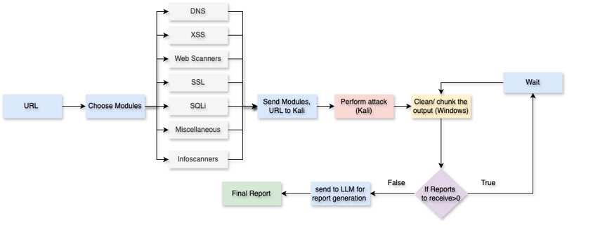
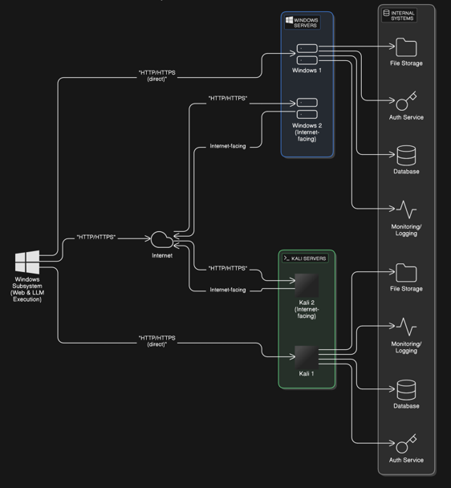

# 🌐 Sarvekshanam: Smart Web Vulnerability Dashboard


[](LICENSE)


> A one-stop offensive security platform for discovering, analyzing, and reporting **web application vulnerabilities** using powerful open-source tools. Integrates automation, AI-assistance, and real-time dashboards to streamline the **pentesting lifecycle**.

---

## 🚀 Features

* 🧠 **AI-Powered Chatbot** – Query results, ask for insights, or launch tools with custom configurations.
* 🛡️ **Modular Tool Execution** – Run vulnerability scanners based on categories like XSS, SQLi, DNS, SSL, etc.
* 📊 **Visual Dashboards** – See live vulnerability data, tool outputs, and scan logs in one place.
* 📝 **Auto-Generated Reports** – Summarized scan results available for download and post-analysis.
* 🔀 **Contextual Reset** – Reset chatbot context after final report generation to start fresh.

---

## 🧰 Categories & Modules

Tools are listed under different modules. To view or customize tool behavior, see `kali/tools.json`.

| Category        | Example Tools                                     |
| --------------- | ------------------------------------------------- |
| **XSS**         | XSStrike, XSSVibes, XSpear, PwnXSS, XSSer         |
| **SQLi**        | SQLMap                                            |
| **DNS**         | Dig, DNSenum, DNSrecon, Domain Analyzer, Fierce   |
| **WebScanner**  | Wapiti                                            |
| **SSL**         | SSLscan, SSLyze, TestSSL                          |
| **InfoScanner** | Httpx, WhatWeb, Wafw00f, SHCheck, S3Scanner, Nmap |
| **Misc**        | PPFuzz, CSP Analyzer, Clickjacking Tester         |
| **Assetfinder** | Arjun, Sublist3r, AssetFinder                     |
| **Pathfinders** | Wfuzz, Gobuster, Ffuf, Dirsearch                  |

---

## 🧠 Flowchart



---

## 🧠 Architecture



---

## 🛠️ Tech Stack

* **Frontend:** HTML, CSS, JavaScript, Tailwind
* **Backend:** Flask (Python)
* **Database:** SQLite
* **AI Integration:** Groq API (Llama3-70b-8192)
* **Automation:** Bash Scripts + Tool Wrappers

---

## ⚡ Installation & Setup

### Prerequisites

* Kali Linux system (preferably in a VM)
* Ensure **network adapter is set to *Bridged Adapter*** for internet access
* Set `WINDOWS_CALLBACK` environment variable to `http(s)://<WIN_IP>:5000/callback` in Kali
* Set `GROQ_API_KEY` for llama3-70b-8192 and `MY_IP` in Windows

### Setup Steps

```bash
# For Kali Linux:
# 1. Clone the repository
cd ~
git clone https://github.com/A-Y-U-S-H-Y-A/sarvekshanam.git
cd sarvekshanam

# 2. Navigate to the for_kali folder
cd for_kali

# 3. Make sure all required tools are installed as per tools.json
# Use apt, pip, or git clone as appropriate for each tool

# 4. Run the Kali execution handler
python3 kali.py
```

```bash
# For Windows:
# 1. Clone the repository (using Git Bash or Command Prompt)
git clone https://github.com/A-Y-U-S-H-Y-A/sarvekshanam.git
cd sarvekshanam

# 2. Run the dashboard application
python app.py

# 3. Access the web interface
# Visit http://localhost:5000 in your browser
```

---

## 📹 Demo Videos

### Chatbot Interface Demo


### Dashboard Functionality Demo


---

## 🤝 Contributing

We welcome contributions! To get started:

1. Fork this repository
2. Create your feature branch (`git checkout -b feature-name`)
3. Commit your changes (`git commit -m 'Add new feature'`)
4. Push to the branch (`git push origin feature-name`)
5. Open a Pull Request

### Main Contributors

* **Ayushya Shah** · [@A-Y-U-S-H-Y-A](https://github.com/A-Y-U-S-H-Y-A)
* **Rushank Shah** · [@rushank24](https://github.com/rushank24)
* **Arhya Singh** · [@arhyachan](https://github.com/arhyachan)

---

## 📜 License

**Sarvekshanam** is released under the GPL-3.0 License.

---

## 📨 Contact

> For suggestions or collaborations: `ayushya.shah1201@gmail.com`

---

🌟 Star this repo to support the project!